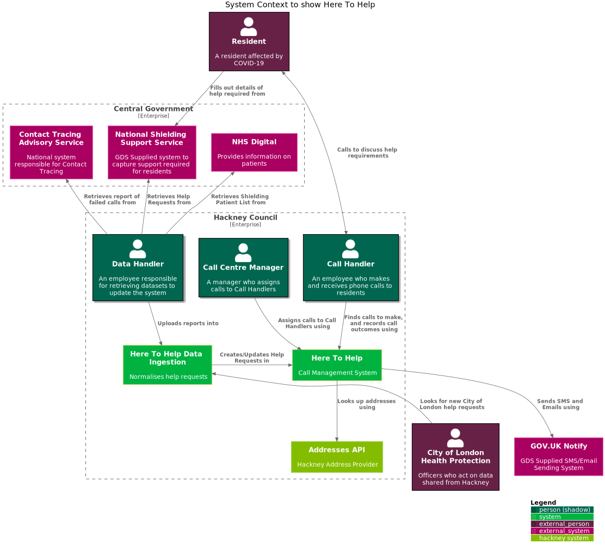
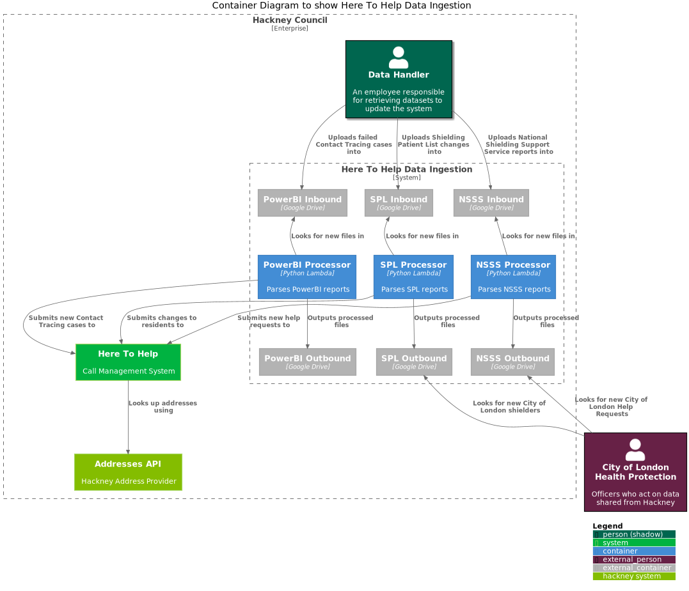
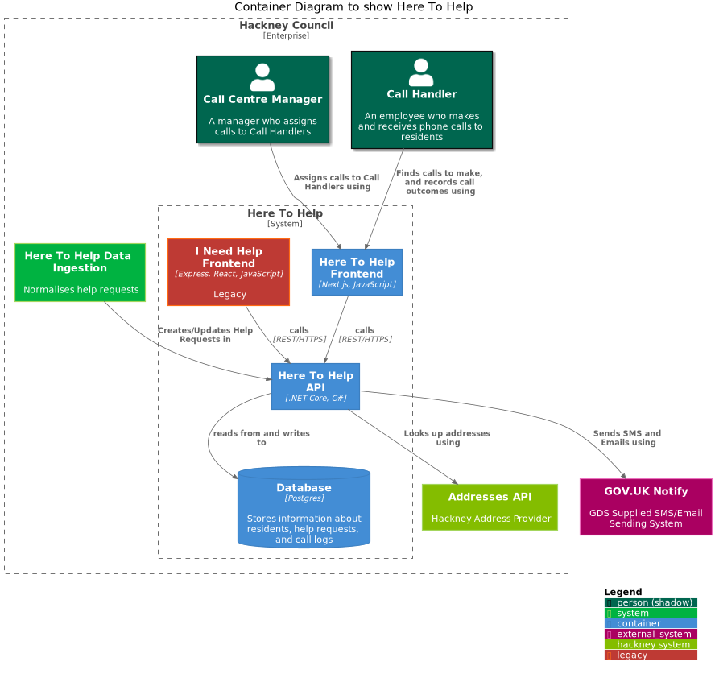

# C4 Architecture Diagrams for Here To Help service

These diagrams are designed to give an overview of the system that has been put together for Here To Help.

### What is a C4 Diagram?

C4 diagrams show an increasing level of detail of systems. See [c4model.com](https://c4model.com/) for more information.

1. System Context Diagram - This gives a sense of how users interact with high-level systems, and how these high level systems interact with other internal/external systems.
1. Container Diagram - A deeper dive into each of the systems described, showing in more detail the containers that contribute to a system. Components in this context are thought of as single runtime applications.
1. Component Diagram - Components show a more granular detail of a Container, for example Controllers, Usecases, and Gateways.
1. Code - Finally, the code that make up each component can be described using UML. Databases, and applications can be described at this level.

## System Context Diagram

This diagram shows the Here To Help system as a whole, including external services and users.

## Container Diagrams

The following diagrams show the contains within specific systems of this product.

### Here To Help Data Ingestion

### Here To Help

